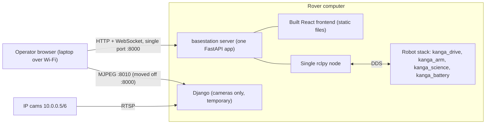
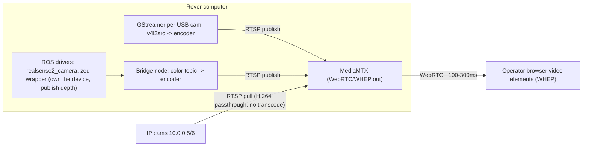

# Basestation Ground-Up Redesign (Co-located with Robot)

Status: **not started** — plan agreed 2026-07-18. Camera details expanded in
[CAMERAS.md](CAMERAS.md).

Phase 1: replace the four-service basestation stack (Django + two FastAPI apps
+ Vite dev server) with a single FastAPI backend embedding one rclpy node,
WebSocket teleop/telemetry, a statically built frontend, and one systemd
bringup chain. Phase 2: replace the JPEG-polling camera pipeline with MediaMTX
+ hardware H.264 + WebRTC, with exactly one owner per video device.

## What stays the same

The operator still opens a browser on a separate laptop, so a web stack on the
rover is still the right shape. The React UI (drive, arm + 3D URDF, science,
cameras, checklist, logs, PIN) is worth keeping — it gets rebuilt, not
rewritten.

## Ground-up design

### 1. One backend service instead of three

A single FastAPI app (new `basestation/server/`) replaces Django (:8000), drive
FastAPI (:8080), and arm FastAPI (:8001). It embeds **one** `rclpy` node on a
background executor thread with all publishers/subscribers:

- **WebSocket `/ws/control`** — gamepad drive (`/cmd_vel`) and arm commands
  (`/kanga_arm/joint_control`, `kanga_arm/ee_state_control`, mode toggle).
  Replaces HTTP POST per gamepad tick — the current UI fires 10-100 POSTs/sec
  (10 ms interval on ArmControlCompact, 50 ms on Dashboard) with no ordering
  guarantee, so on a Wi-Fi hiccup a stale "full speed" command can be applied
  after a newer "stop". Browser still polls the gamepad (~50 Hz — the Gamepad
  API is polling-only, that part is fine and universal) but sends at a fixed
  20-30 Hz with change-detection and a keepalive over one ordered WebSocket.
  The server publishes a zero Twist if no message arrives within ~300-500 ms.
- **Robot-side `/cmd_vel` watchdog in `kanga_drive`** — `wheel_command_mapper`
  currently has **no command timeout** and the ODrives hold their last
  commanded velocity, so a frozen tab / dropped Wi-Fi / dead basestation
  process mid-drive leaves the rover moving indefinitely. Add a wall timer
  that zeroes wheel commands if no `/cmd_vel` arrives within a configurable
  timeout. Small standalone change in `kanga_drive`; worth doing first,
  independent of the rest of this plan.
- **WebSocket `/ws/telemetry`** — pushes battery (`/battery/battery_info`,
  `/battery/bms_status`), `/joint_states`, and `kanga_science/*` at a fixed
  rate. Replaces frontend REST polling and removes the need for Redis caching
  entirely.
- **REST** — one-shot actions only: science heating/cooling/actuator,
  checklist, logs, PIN, NIR servo GPIO.

**Cameras: handled in Phase 2 (see [CAMERAS.md](CAMERAS.md)).** During Phase 1
the existing Django camera endpoints keep running as-is — Django is reduced to
cameras-only and moved to `:8010` so the new server can own `:8000`. It is
deleted at the end of Phase 2.

**Why rclpy and not rclcpp:** the rover-side packages are rclcpp, but ROS 2 is
language-agnostic over DDS (`kanga_interfaces` generates both bindings), so
mixing is the normal pattern. The basestation node only moves small messages at
low rates (~30-60 Hz commands, few-Hz telemetry); the ~0.5 ms rclpy overhead
per message is negligible next to the Wi-Fi hop to the operator laptop. rclcpp
would matter for per-frame image work (deferred) but would make the
HTTP/WebSocket server side far more work. If a hot path emerges later, move
just that piece into a small rclcpp node.

### 2. Frontend built, not dev-served

`vite build` output served as static files by the same FastAPI app. Everything
is same-origin on one port, so `config.js`'s per-port URL builders and Django's
CORS/`ALLOWED_HOSTS` (`10.0.0.1`/`10.0.0.2` hardcoding) disappear. No
`npm run dev` systemd service.

### 3. One bringup chain

- Single ROS env script (reuse `/home/kanga/kanga/onboard_ros_env.sh`) sourcing
  `/opt/ros/humble` + `/home/kanga/kanga/kanga/install/setup.bash` — fixes the
  dead `KANGA_ROS2_WS=/home/kanga/kanga/ARCH2026-Kanga` path in the current
  units.
- systemd: `onboard_drive.service` (robot stack) + one `basestation.service`
  with `After=`/`Wants=` on it. Replaces the four `basestation-*` units.
- Keep `ROS_DOMAIN_ID=0`, `ROS_LOCALHOST_ONLY=0` so Foxglove/`ros2` CLI on the
  laptop still see the graph (needed for the AutoMap embed).

### 4. Deleted outright

- Django REST/telemetry/arm code, django-redis, Redis dependency (Django itself
  stays temporarily, serving only the camera endpoints until the camera rework)
- Duplicate arm bridge (Django `/api/arm-*` vs FastAPI :8001 — collapse to one
  implementation)
- Docker compose stack, `supervisord.conf`, `startup.sh` (two-computer/legacy
  artifacts)
- `robot_controller/` mocks + `process_manager` (:8081) — or keep as an
  optional dev tool, decoupled from the main stack

### Considered and rejected

- **rosbridge/roslibjs (browser talks ROS directly):** less backend code, but
  PIN gating, RTSP proxying, GPIO, checklists and logs still need a server, so
  it doesn't actually remove a tier — and it exposes the whole ROS graph to the
  browser.
- **Replace UI with Foxglove:** loses the purpose-built competition UI.

## Phase 2: Camera pipeline redesign

Full diagnosis, hardware comparison (Orin NX vs Nano, encoder boxes), and
design details live in [CAMERAS.md](CAMERAS.md). Summary:

- One owner per `/dev/video*` device, declared in a single camera config.
- Encoder element configurable per camera: `nvv4l2h264enc` (NVENC, Orin NX) or
  `x264enc` (software, Orin Nano — no NVENC exists on that module).
- Frontend swaps JPEG polling for WHEP `<video>` elements.
- Rollout is per-camera, IP cams first (passthrough, zero risk), old MJPEG
  endpoints kept as fallback until every feed is verified.

## Migration approach

- Phase 1: build the new server alongside the existing stack (different port),
  reach feature parity page by page, then swap systemd units and delete the old
  services. The React components mostly survive — only the API/WS client layer
  (`config.js` and axios calls) changes.
- Phase 2: bring up MediaMTX beside the existing Django camera service and
  migrate camera by camera, keeping the old MJPEG endpoints as fallback until
  every feed is verified on WebRTC.

## Task list

### Phase 0 (safety, do first, standalone)

1. Add a `/cmd_vel` timeout watchdog to `wheel_command_mapper` in
   `kanga_drive`: zero the wheels if no command arrives within a configurable
   timeout (e.g. 500 ms). Protects against frozen browser tabs, Wi-Fi drops,
   and basestation process death regardless of any other work.

### Phase 1

1. Scaffold `basestation/server/` FastAPI app with a single rclpy node on an
   executor thread, plus static file serving.
2. Implement `/ws/control`: gamepad drive to `/cmd_vel` with dead-man
   zero-Twist, arm command topics.
3. Implement `/ws/telemetry`: battery, joint_states, science topics pushed at a
   fixed rate.
4. Port remaining Django REST endpoints: science controls, checklist, logs,
   PIN, NIR servo GPIO.
5. Switch frontend to a same-origin API/WS client, `vite build`, serve
   statically.
6. New env sourcing + single `basestation.service` chained after
   `onboard_drive.service`; remove the four old units and the stale
   `KANGA_ROS2_WS` path.
7. After parity: strip Django down to cameras-only (moved to :8010), remove
   Redis, the duplicate arm FastAPI, and the Docker/supervisord/startup.sh
   legacy.

### Phase 2 (cameras — see CAMERAS.md)

1. Install MediaMTX as a systemd service; RTSP pull for IP cams 10.0.0.5/6 with
   WebRTC (WHEP) output; verify latency vs direct view.
2. Per-USB-camera GStreamer pipeline (`v4l2src -> encoder -> rtspclientsink`)
   into MediaMTX, encoder element configurable, driven by one camera-ownership
   config.
3. D435i/ZED2i via ROS drivers (depth stays in ROS); bridge color image topic
   -> encoder -> MediaMTX for the webpage.
4. Replace `VideoFeedCard` JPEG polling with a WHEP WebRTC `<video>` element;
   camera list from MediaMTX paths.
5. Retire Django camera code and the `kanga_cameras` publisher (or keep a topic
   tee only where robot code needs frames); delete the cameras-only Django
   service.
