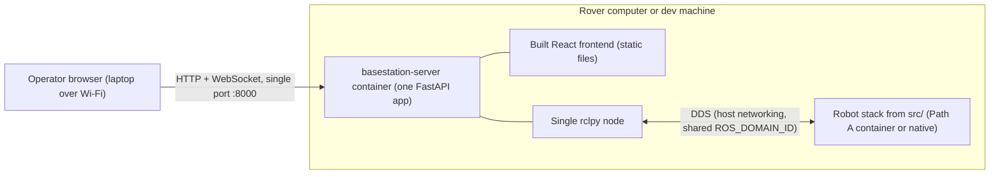
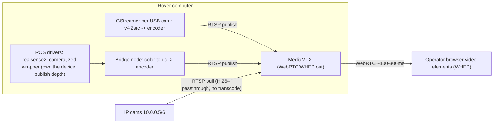

# Basestation Ground-Up Redesign (Co-located with Robot)

Status: **not started** — plan agreed 2026-07-18. Camera details expanded in
[CAMERAS.md](CAMERAS.md).

Phase 1: replace the four-service basestation stack (Django + two FastAPI apps
+ Vite dev server) with a single FastAPI backend embedding one rclpy node,
WebSocket teleop/telemetry with dead-man stop, a statically built frontend,
and one bringup path that is the same in dev and on the rover. Phase 2:
replace the JPEG-polling camera pipeline with MediaMTX + hardware H.264 +
WebRTC, with exactly one owner per video device.

## Use cases this is built around

Operators (competition / field):

- Open one browser on a laptop and drive/control the rover over Wi-Fi.
- See live robot state (battery, arm, science) without juggling refreshes.
- Keep the competition UI (drive, arm + 3D, science, cameras, checklist, logs,
  PIN) — rebuild plumbing, keep the product.
- Video that stays usable at range (less lag / freezing on a bad link).
- If the laptop, tab, or link drops mid-drive, the rover must stop — not keep
  rolling.

Developers (club members):

- Work on robot software with a simple Docker setup (minimal host install
  pain).
- Optionally start the operator UI against that same robot software to test
  control end-to-end.
- Same story on a laptop in dev and on the rover in prod.
- No messy multi-app stack just to try something.

Team / product:

- One ongoing codebase for rover + operator UI; migrate carefully — keep
  known-good behaviour first, replace pieces when validated.
- The operator UI uses the ROS interfaces and topic contracts defined on the
  robot (`src/`) side — one source of truth, never a parallel copy of
  message/topic definitions.

## Context needed to work on this from any machine

Source repositories:

- **This repo (target):** https://github.com/UOW-TronSoc/ARCh-Kanga
- **Legacy basestation (porting reference for UI + REST endpoints):**
  https://github.com/UOW-TronSoc/ARCh2026-BaseStation — running live on the
  rover at `/home/kanga/kanga/basestation`.
- **Legacy robot code (topic-contract reference):** `ARCH2026-Kanga` at the
  commit pinned in the repo root README; the live (possibly diverged) copy is
  the rover's workspace at `/home/kanga/kanga/kanga`.

**Sequencing: rover code merges in first.** The old rover code (including
`kanga_interfaces` — `BatteryInfo`, `BmsStatus`, `ScienceControl`,
`ScienceFeedback`, `ControlMessage`, `ControllerStatus`, `ODriveStatus`,
`AxisState.srv`, currently only in the rover's live workspace) is being
migrated into this repo's `src/` **before** basestation development starts.
This plan assumes that migration is done: Phase 1 begins with the interfaces
and robot packages already building via Path A.

### Topic contract (as implemented on the 2026 rover)

| Topic | Type | Direction |
|---|---|---|
| `/cmd_vel` | `geometry_msgs/Twist` | UI -> drive |
| `/kanga_arm/joint_control` | `sensor_msgs/JointState` | UI -> arm |
| `kanga_arm/ee_state_control` | `geometry_msgs/Twist` | UI -> arm |
| `kanga_arm/control_mode_joint` | `std_msgs/Bool` | UI -> arm |
| `/joint_states` | `sensor_msgs/JointState` | robot -> UI |
| `kanga_science/heating` | `std_msgs/Bool` | UI -> robot |
| `kanga_science/cooling` | `std_msgs/Bool` | UI -> robot |
| `kanga_science/linear_actuator_speed` | `std_msgs/Int32` | UI -> robot |
| `kanga_science/temperatures` | `std_msgs/Float32MultiArray` | robot -> UI |
| `kanga_science/ultrasonic_cm` | `std_msgs/Float32` | robot -> UI |
| `kanga_science/current_amps` | `std_msgs/Float32` | robot -> UI |
| `kanga_science/spectrophotometer` | `std_msgs/Float32MultiArray` | robot -> UI |
| `/battery/battery_info` | `kanga_interfaces/BatteryInfo` | robot -> UI |
| `/battery/bms_status` | `kanga_interfaces/BmsStatus` | robot -> UI |

This table is a snapshot for bootstrapping on a fresh machine; once the
interfaces and robot packages are migrated into `src/`, the code there is the
source of truth and this table should not be maintained separately.

Rover-only items (everything else can be developed and tested on a laptop via
Path A + Path C): NIR servo GPIO (Jetson.GPIO), real cameras (IP cams at
`10.0.0.5`/`10.0.0.6`, `/dev/video*`), CAN hardware, and final parity
verification against the legacy stack.

## What stays the same

The operator still opens a browser on a separate laptop, so a web stack on the
rover is still the right shape. The React UI (drive, arm + 3D URDF, science,
cameras, checklist, logs, PIN) is worth keeping — it gets rebuilt, not
rewritten.

## Ground-up design

The legacy four-service stack on the current rover
(`/home/kanga/kanga/basestation`: Django :8000, drive FastAPI :8080, arm
FastAPI :8001, Vite :3000) stays untouched and running as the fallback until
this stack reaches parity — cameras included. Nothing needs to be carved out
of it mid-migration.

### 1. One backend service instead of three

A single FastAPI app (new `basestation/server/`) replaces Django (:8000), drive
FastAPI (:8080), and arm FastAPI (:8001). It embeds **one** `rclpy` node on a
background executor thread with all publishers/subscribers:

- **WebSocket `/ws/control`** — gamepad drive (`/cmd_vel`) and arm commands
  (`/kanga_arm/joint_control`, `kanga_arm/ee_state_control`, mode toggle).
  Replaces HTTP POST per gamepad tick — the current UI fires 10-100 POSTs/sec
  (10 ms interval on ArmControlCompact, 50 ms on Dashboard) with no ordering
  guarantee, so on a Wi-Fi hiccup a stale "full speed" command can be applied
  after a newer "stop". Browser still polls the gamepad (~50 Hz — the Gamepad
  API is polling-only, that part is fine and universal) but sends at a fixed
  20-30 Hz with change-detection and a keepalive over one ordered WebSocket.
  **Dead-man stop:** the server publishes a zero Twist if no message arrives
  within ~300-500 ms, covering frozen tabs, dropped Wi-Fi, and closed laptops.
- **Requirement to carry into the drive/ODrive rebuild** (not a task here —
  that stack is being rebuilt from the ground up separately): the drive layer
  must have its own `/cmd_vel` timeout that zeroes the wheels. The legacy
  `wheel_command_mapper` has no command timeout and the ODrives hold their
  last commanded velocity, so today a dead basestation process mid-drive
  leaves the rover moving indefinitely. The new drive stack should never trust
  the command source to keep talking.
- **WebSocket `/ws/telemetry`** — pushes battery (`/battery/battery_info`,
  `/battery/bms_status`), `/joint_states`, and `kanga_science/*` at a fixed
  rate. Replaces frontend REST polling and removes the need for Redis caching
  entirely.
- **REST** — one-shot actions only: science heating/cooling/actuator,
  checklist, logs, PIN, NIR servo GPIO.

**Cameras: handled in Phase 2 (see [CAMERAS.md](CAMERAS.md)).** During Phase 1
camera feeds keep coming from the legacy stack on the rover; the new server
does not touch video. In Phase 2 MediaMTX takes over feed by feed.

**Topic contracts come from `src/`.** The server imports `kanga_interfaces`
(and topic names) from the bind-mounted workspace `install/` — the same
overlay the robot nodes use — via the existing container entrypoint that
sources `/opt/ros/humble` then `/workspace/install/setup.bash`
([docker-entrypoint.bash](docker-entrypoint.bash)). No message or topic
definitions are ever duplicated on the basestation side.

**Why rclpy and not rclcpp:** the rover-side packages are rclcpp, but ROS 2 is
language-agnostic over DDS (`kanga_interfaces` generates both bindings), so
mixing is the normal pattern. The basestation node only moves small messages at
low rates (~30-60 Hz commands, few-Hz telemetry); the ~0.5 ms rclpy overhead
per message is negligible next to the Wi-Fi hop to the operator laptop. rclcpp
would matter for per-frame image work (deferred) but would make the
HTTP/WebSocket server side far more work. If a hot path emerges later, move
just that piece into a small rclcpp node.

### 2. Frontend built, not dev-served

React frontend built with `vite build` in a multi-stage Docker build (node
stage builds, output copied into the Python image) and served as static files
by the same FastAPI app. Everything is same-origin on one port, so the legacy
`config.js` per-port URL builders and CORS/`ALLOWED_HOSTS` IP hardcoding
(`10.0.0.1`/`10.0.0.2`) disappear. For frontend iteration, `vite dev` on the
host with a proxy to `:8000` still works — it just isn't the deployed shape.

### 3. Docker-first bringup — same shape in dev and prod

The existing dev workflows stay exactly as documented in the repo README; the
operator stack just collapses from four compose services to one.

- **Path A (robot / ROS work)** — unchanged:
  `docker compose -f docker/compose.dev.yaml build`, `./scripts/docker_shell.bash`,
  then `./scripts/build_workspace.bash` + `source install/setup.bash` inside.
- **Path B (operator UI)** — `./scripts/basestation_up.bash` /
  `basestation_down.bash`, unchanged commands, but
  [docker/compose.basestation.yaml](../docker/compose.basestation.yaml) shrinks
  to a single `basestation-server` service (plus MediaMTX in Phase 2). Same
  guard (refuses to start until `install/setup.bash` exists), same host
  networking / `ipc: host` / `ROS_DOMAIN_ID` env, same bind-mounted
  `/workspace`, same entrypoint sourcing pattern. UI moves from :3000 to
  `http://localhost:8000/`. The `Dockerfile.basestation-frontend` nginx
  scaffold and the three uvicorn stub services retire.
- **Path C (end-to-end control test)** — unchanged story: run Path A with
  robot nodes up, run Path B beside it; both are host-network DDS participants
  on the same `ROS_DOMAIN_ID`, so the UI drives the real nodes with no extra
  wiring. This works identically on a dev laptop and on the rover.
- **Rover (prod)**: the same compose file with `restart: unless-stopped` (or a
  thin systemd unit that runs `docker compose -f docker/compose.basestation.yaml up`),
  after the robot bringup. No separate prod stack to maintain — dev and prod
  differ only in what starts it.
- Keep `ROS_LOCALHOST_ONLY=0` so Foxglove/`ros2` CLI on the operator laptop
  still see the graph.

### 4. Not migrated from the legacy basestation

- Django project, django-redis, Redis dependency
- The duplicate arm bridge (legacy had Django `/api/arm-*` *and* FastAPI
  :8001 — one implementation in the new server)
- `supervisord.conf`, `startup.sh`, and the legacy repo's own docker-compose
  (two-computer artifacts; `kanga_wip/docker/` is the replacement)
- `robot_controller/` mocks + `process_manager` (:8081) — if mock publishers
  are wanted for UI dev without hardware, that becomes a small script run
  inside the Path A container instead

### Considered and rejected

- **rosbridge/roslibjs (browser talks ROS directly):** less backend code, but
  PIN gating, RTSP proxying, GPIO, checklists and logs still need a server, so
  it doesn't actually remove a tier — and it exposes the whole ROS graph to the
  browser.
- **Replace UI with Foxglove:** loses the purpose-built competition UI.

## Review feedback and responses

The original basestation author reviewed this plan and raised two objections:
(1) don't replace reliable REST with WebSockets — you'll forever be chasing
connection drops; (2) skip WebRTC for video — use plain TCP or RTSP instead.
Both come from real field experience; the responses below are why the plan
holds, and are recorded here so the reasoning lives with the decisions.

### REST vs WebSocket for control

Only the high-rate, safety-critical streams (drive/arm commands + telemetry)
move to WS. One-shot actions (science, checklist, logs, PIN, servo) stay REST.
It is not a wholesale switch.

The switch is not just for the dead-man. Four reasons:

1. **Ordering.** The legacy ~60 POST/sec drive loop
   ([Dashboard.jsx](https://github.com/UOW-TronSoc/ARCh2026-BaseStation) sends
   at a 16 ms interval) has no ordering guarantee — after a Wi-Fi stall a stale
   "full speed" can be applied after a newer "stop", and the 3 s command
   timeout means dozens of stale requests can still be in flight when the link
   recovers. One ordered WS stream makes out-of-order application structurally
   impossible, with zero code dedicated to preventing it.
2. **Telemetry deletes code.** WS push lets us drop Redis/django-redis
   entirely — it only exists to cache the "latest value" for REST pollers.
   Fewer moving parts, not more.
3. **Overhead.** 60 req/sec of full HTTP headers + middleware (the legacy
   stack even runs request-logging middleware per command POST) vs small
   frames on one open socket — less contention with video on a bad link.
4. **Dead-man.** The server can only tell "link dead" from "operator idle" if
   there is a live session with a liveness signal.

The real comparison is not "simple REST vs complex WS". To make REST hit the
same safety bar you need hand-rolled heartbeats, sequence numbers, timeout
tracking, and Redis — *more* custom code with subtler failure modes (cache
staleness, poller races). The simple REST version is the one running today,
which is the unsafe one.

The "chasing drops forever" pain comes from proxies, load balancers, and NAT —
none of which exist here (one browser <-> one FastAPI process, one LAN hop,
same origin). To keep connection management near-zero maintenance for whoever
takes the project over next, the plan commits to:

- Native `WebSocket` API only — no socket.io or wrapper libraries.
- Plain JSON, a handful of documented message types, no acks or custom framing.
- One fixed reconnect policy (fixed ~1 s retry on close), connection state
  shown prominently in the UI.
- **Drive-enable resets to OFF on any reconnect** — the operator must
  deliberately re-arm, so a reconnect bug can never cause motion.
- Refresh always fully recovers — the server holds no session state worth
  preserving (PIN in a cookie, telemetry re-pushes immediately).

Failure direction is safe by design: a dropped control link degrades to "rover
stops + disconnected badge", never to invisible misbehaviour.

### WebRTC vs plain TCP/RTSP for video

WebRTC is genuinely painful — but that pain is NAT traversal (STUN/TURN/SDP/
signaling), which does not apply on a flat LAN with known IPs, and MediaMTX
handles the signaling (WHEP) anyway. Nobody hand-rolls `RTCPeerConnection`
plumbing.

Two blockers on the proposed alternative:

- **Browsers cannot play RTSP** (no `<video src="rtsp://...">`), so a
  server-side component must repackage the stream for the browser regardless —
  that component is exactly what MediaMTX is.
- **TCP is the actual cause of today's freezing-at-range**: retransmits stall
  the stream and latency snowballs. MJPEG (current) and RTSP-over-TCP share
  this failure mode. WebRTC rides UDP and drops frames instead of accumulating
  delay — which is the "usable at range" requirement.

RTSP is still used — as the *ingest* protocol (IP cams passthrough, GStreamer
publish into MediaMTX). The only disagreement is the last hop to the browser.
Rollout is per-camera, IP cams first (passthrough, near-zero risk), with old
MJPEG kept as fallback until each feed is verified. If WebRTC fights us on the
real rover network, the fallback is MediaMTX's LL-HLS output from the same
server (trivial in-browser, no signaling), not RTSP.

### One open question carried back to the reviewer

The sharpest version of the transport objection is **UDP for control**
(unreliable datagrams — fresh-but-lossy beats ordered-but-stale for teleop,
since a TCP-based WS can still head-of-line-block newer commands behind a
retransmit). The plan uses WS as a safe middle ground because the dead-man
makes a stalled channel degrade to "stop". If unreliable datagrams (UDP or an
unreliable WebRTC data channel) are worth the extra complexity, that remains
open for discussion.

## Phase 2: Camera pipeline redesign

Full diagnosis, hardware comparison (Orin NX vs Nano, encoder boxes), and
design details live in [CAMERAS.md](CAMERAS.md). Summary:

- One owner per `/dev/video*` device, declared in a single camera config.
- Encoder element configurable per camera: `nvv4l2h264enc` (NVENC, Orin NX) or
  `x264enc` (software, Orin Nano — no NVENC exists on that module).
- Frontend swaps JPEG polling for WHEP `<video>` elements.
- Rollout is per-camera, IP cams first (passthrough, zero risk), old MJPEG
  endpoints kept as fallback until every feed is verified.

## Migration approach

- Phase 1: build the new server in this repo while the legacy stack keeps
  running on the rover, reach feature parity page by page (validated via
  Path C on a dev machine), then deploy the compose stack to the rover and
  retire the legacy services. The React components mostly survive — only the
  API/WS client layer (`config.js` and axios calls) changes.
- Phase 2: bring up MediaMTX beside the legacy camera endpoints and migrate
  camera by camera, keeping the old MJPEG feeds as fallback until every feed
  is verified on WebRTC.
- Migration principle from the repo README applies throughout: preserve
  known-working behaviour first, validate it, only then remove the old path.

## Task list

### Prerequisite (separate work, in progress)

Merge the old rover code into this repo's `src/` — including
`kanga_interfaces`. Everything below assumes the interfaces and robot packages
build via Path A.

### Phase 1

1. Scaffold `basestation/server/` FastAPI app with a single rclpy node on an
   executor thread, plus static file serving. Reuse the existing entrypoint
   sourcing pattern so `kanga_interfaces` and topic contracts come from the
   bind-mounted `install/`.
2. Collapse `docker/compose.basestation.yaml` to one `basestation-server`
   service (multi-stage Dockerfile: node stage runs `vite build`, Python stage
   serves it); retire the nginx frontend scaffold and the three uvicorn stubs;
   keep `basestation_up.bash` / `basestation_down.bash` working unchanged
   (Path B), including the `install/` guard.
3. Implement `/ws/control`: gamepad input sent at fixed 20-30 Hz with
   change-detection and keepalive; server-side dead-man publishes zero Twist
   on ~300-500 ms silence; arm command topics.
4. Implement `/ws/telemetry`: battery, joint_states, science topics pushed at
   a fixed rate.
5. Port the operator REST actions from the legacy Django app: science
   controls, checklist, logs, PIN, NIR servo GPIO.
6. Migrate the React UI (drive, arm + 3D URDF, science, checklist, logs, PIN)
   onto the same-origin API/WS client; verify Path C end-to-end (Path A robot
   nodes + Path B UI on one machine).
7. Rover deployment: same compose file started on boot (restart policy or a
   thin systemd wrapper), brought up after robot bringup; legacy stack retired
   from the rover once parity is verified.

Carried requirement (not a task here): the ground-up drive/ODrive rebuild must
include its own `/cmd_vel` timeout that zeroes the wheels — never trust the
command source to keep talking.

### Phase 2 (cameras — see CAMERAS.md)

1. Add MediaMTX as a service in `docker/compose.basestation.yaml` (official
   image, host networking); RTSP pull for IP cams 10.0.0.5/6 with WebRTC
   (WHEP) output; verify latency vs direct view.
2. Per-USB-camera GStreamer pipeline (`v4l2src -> encoder -> rtspclientsink`)
   into MediaMTX, encoder element configurable, driven by one camera-ownership
   config.
3. D435i/ZED2i via ROS drivers (depth stays in ROS); bridge color image topic
   -> encoder -> MediaMTX for the webpage.
4. Replace `VideoFeedCard` JPEG polling with a WHEP WebRTC `<video>` element;
   camera list from MediaMTX paths.
5. Retire the legacy camera path entirely: the old Django camera endpoints on
   the rover and the `kanga_cameras`-style publisher (keep a topic tee only
   where robot code needs frames).
