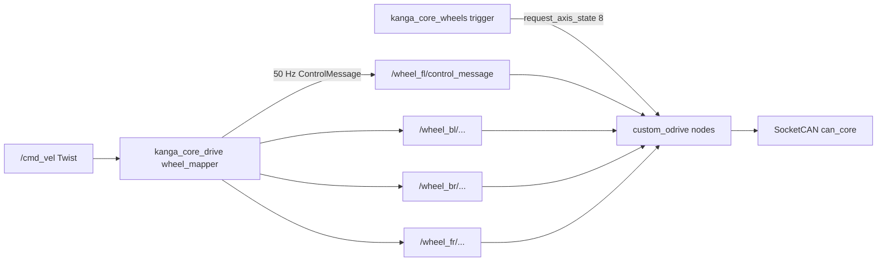

# Next steps: core drive + ODrive stack

Hand-off document for continuing work on another machine. **Do not treat this as
implemented** — it is the agreed design and branch plan only.

Related: [migration overview](README.md), vendor notes in
[`src/vendor/README.md`](../../src/vendor/README.md), ODrive package
[`custom-ros-odrive`](https://github.com/UOW-TronSoc/custom-ros-odrive).

Old reference (mapper / launch behaviour):
`ARCH2026-Kanga` / local checkout under `kanga` → `src/kanga_drive`
(`wheel_command_mapper.cpp`, `odrive_multi.launch.py`,
`odrive_node_ids_drive.yaml`).

---

## Locked decisions

| Topic | Decision |
|-------|----------|
| Package split | New **`kanga_core_wheels`** (ODrive launch, Fibre configs, commission, closed-loop trigger) + **`kanga_core_drive`** (twist→wheel only). Rename `kanga_core_wheels` before merge if preferred. |
| Startup | Launch ODrive nodes **idle**; **no** CLOSED_LOOP until an explicit trigger. No joy / “arm” path in this work. |
| Vendor | Pin `custom-ros-odrive` in `kanga_vendor.repos`; Kanga packages **depend** on `custom_odrive`. |
| Invert | Only via `invert_direction` in launch. Mapper must **not** invert again. |
| Control rate | Publish wheel setpoints at **50 Hz** (feeds ODrive firmware watchdog). |
| Twist watchdog | If `/cmd_vel` is stale → force **zero** velocities and keep publishing zeros at 50 Hz. |
| Errors / WHS / joint states | Out of scope for this slice. |



---

## Branch order (one concern per branch)

1. **`feat/vendor-odrive-pin`** — pin repo + docs status
2. **`feat/core-wheels`** — new package (launch, configs, commission, trigger)
3. **`feat/core-drive-mapper`** — twist mapper + 50 Hz + stale stop

Merge each through PR into `develop` → `main` so history stays readable.

---

## Branch 1 — `feat/vendor-odrive-pin`

### `src/vendor/kanga_vendor.repos`

Add (pin to a commit or tag on `main` of custom-ros-odrive after you choose one):

```yaml
custom_ros_odrive:
  type: git
  url: https://github.com/UOW-TronSoc/custom-ros-odrive.git
  version: <commit-or-tag>
```

(`ros2_socketcan` at `1.3.0` already present.)

### Import / build reminder

```bash
vcs import src/vendor < src/vendor/kanga_vendor.repos
colcon build --packages-select custom_odrive odrive_base
source install/setup.bash
```

### Docs to update in the same PR

- [`src/vendor/README.md`](../../src/vendor/README.md) — ODrive section: URL, pin, import note
- [`docs/migration/README.md`](README.md) — step 3 → pinned; point “next up” here
- Root [`README.md`](../../README.md) — current status

---

## Branch 2 — `feat/core-wheels`

New package: `src/kanga_core/kanga_core_wheels/`

Depends on `custom_odrive` (and `std_srvs` / `rclpy` or `rclcpp` as needed).
**Does not** own kinematics or `/cmd_vel`.

### Owns

| Piece | Role |
|-------|------|
| `launch/wheels.launch.py` | 4× `custom_odrive_node` on **`can_core`**, namespaces `wheel_fl` / `wheel_bl` / `wheel_br` / `wheel_fr`, node_ids **1–4**, left side `invert_direction: true`, **`start_enabled: false`**, `control_message_in_radians: true` |
| `config/wheels.yaml` | Canonical namespace / node_id / invert / interface map (launch source of truth) |
| `config/motors/` | Shared + per-wheel Fibre configs (below) |
| `scripts/commission_wheels` | Multi-drive wrapper around `custom_odrive` commission |
| Trigger node/service | Explicit CLOSED_LOOP(8) / IDLE(1) for one or all wheels |

### Wheel map (match old rover + custom_odrive examples)

| Namespace | node_id | invert_direction |
|-----------|---------|------------------|
| `wheel_fl` | 1 | true |
| `wheel_bl` | 2 | true |
| `wheel_br` | 3 | false |
| `wheel_fr` | 4 | false |

### Fibre configs — shared + individual

Move rover-specific motor configs **out of** `custom-ros-odrive` (leave a
generic example there). Layout:

```text
kanga_core_wheels/config/motors/
  shared_motor_config.py      # common odrv.* (no SERIAL_NUMBER / node_id)
  wheel_fl_motor_config.py    # SERIAL_NUMBER + node_id + real per-wheel diffs only
  wheel_bl_motor_config.py
  wheel_br_motor_config.py
  wheel_fr_motor_config.py
```

**Apply rule:** commission script concatenates `shared_motor_config.py` + the
individual file into a temp `.py`, then runs:

```bash
ros2 run custom_odrive commission -- \
  --can can_core \
  --config <temp> \
  --ns /wheel_XX \
  [--calibrate] [--save]
```

When splitting today’s near-duplicate wheel files, put shared values in
`shared_motor_config.py` (normalise baud `500000`, shared `watchdog_timeout`,
shared brake resistance). Keep only serial, `node_id`, and true per-wheel
differences in the individual files.

Source serials today live under
`custom-ros-odrive/custom_odrive/config/wheel_*_motor_config.py`.

### Commission CLI

```bash
ros2 run kanga_core_wheels commission_wheels -- \
  --wheels fl,bl,br,fr \
  --can can_core \
  [--calibrate] [--save]
```

- One drive at a time (Fibre); loop sequentially.
- Always park via `--ns` before Fibre work.
- Thin Python script — not a large node.

### Closed-loop trigger (not “arm”)

Launch leaves motors **present but idle**. Separate small service/node:

- e.g. `set_closed_loop` (`std_srvs/SetBool` or a tiny custom srv)
  - `true` → per selected wheel: `clear_errors`, `set_enabled(true)`,
    `request_axis_state(8)`
  - `false` → `request_axis_state(1)`, optionally `set_enabled(false)`
- Support filtering to one wheel for bench work.

This is the only path into velocity control for this slice. Mapper must **not**
call `request_axis_state` / `set_enabled`.

### Provenance to record in package README

- Old: `kanga_drive` launch/config + `custom-ros-odrive` motor configs
- Changes: `can_core`, `start_enabled: false`, shared Fibre base, explicit
  closed-loop trigger, invert only in launch

---

## Branch 3 — `feat/core-drive-mapper`

Implement against [`src/kanga_core/kanga_core_drive/README.md`](../../src/kanga_core/kanga_core_drive/README.md):
kinematics + ROS glue only.

### Pieces (keep small)

1. **ROS-independent library** — mecanum mix from old
   `kanga_drive/src/wheel_command_mapper.cpp` (roller **51°**,
   `half_length≈0.435`, `half_width≈0.3535`, clamp to `max_wheel_velocity`).
   Unit tests on the library.
2. **`wheel_command_mapper` node**
   - Sub `/cmd_vel` (`geometry_msgs/Twist`)
   - Pub `/wheel_*/control_message` (`custom_odrive/msg/ControlMessage`)
   - Every publish: `control_mode=2`, `input_mode=2` (velocity + vel_ramp)
   - **50 Hz** timer republishes last wheel velocities (firmware watchdog feed)
   - **Stale `/cmd_vel` watchdog:** if no twist within `cmd_vel_timeout`
     (param; suggest default **0.2 s**), set last command to **zeros** and keep
     publishing zeros at 50 Hz
   - **No** invert; **no** axis-state / enable calls
   - Optional light gate: hold zeros if any wheel `controller_status` shows
     `enabled==false` or `axis_state!=8` (no error UX yet)

### Launch

- `kanga_core_drive/launch/drive_mapper.launch.py` — mapper alone
- Full compose (`wheels` + mapper) can wait for `kanga_core_bringup` unless
  needed for bench

### Suggested params

- `control_rate_hz` (50)
- `cmd_vel_timeout` (0.2)
- `max_wheel_velocity`
- geometry (or yaml)
- wheel namespace list

---

## Out of scope for this work

- `kanga_whs` / GPIO / joy enable
- Error notification / operator UX beyond basic logs
- Wheel joint-state / odometry feedback (listed in drive README; defer)
- Science interfaces
- Changing `custom_odrive` C++ behaviour (optional later: strip rover serial
  configs from that repo after the move)

---

## Bench checklist (after implementation)

1. `vcs import` + build `custom_odrive`, `kanga_core_wheels`, `kanga_core_drive`
2. `wheels.launch.py` — four namespaces, IDLE, not enabled
3. Trigger closed-loop on one wheel → `ros2 run custom_odrive velocity_ramp_test`
4. Trigger all four → publish `/cmd_vel`; stop `/cmd_vel` → velocities zero within
   timeout while 50 Hz stream continues
5. `commission_wheels --wheels fl --save` (calibrate only with wheel off ground)
6. Confirm shared+individual merge yields expected serial / `node_id`

---

## Useful interfaces (custom_odrive)

Per namespace (e.g. `/wheel_fl/...`):

| Kind | Name | Notes |
|------|------|-------|
| Sub | `control_message` | Setpoints; ignored if disabled or `/drivestop` |
| Sub | `/drivestop` | Global stop (absolute `std_msgs/Bool`) |
| Pub | `controller_status` | Includes `axis_state`, `enabled` |
| Srv | `request_axis_state` | 8 = CLOSED_LOOP, 1 = IDLE |
| Srv | `set_enabled` | Enable latch |
| Srv | `clear_errors` | |
| Srv | `get_errors` | Defer UX |

No node keepalive: each `control_message` is one CAN setpoint — hence the
50 Hz mapper stream.
