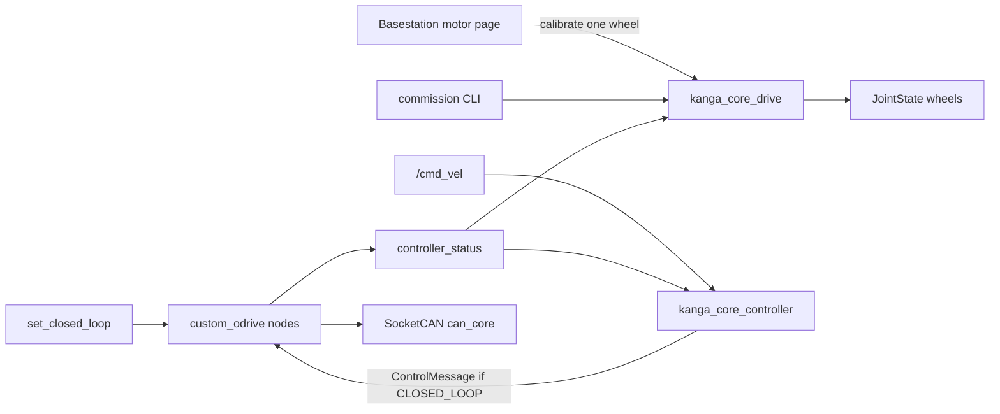

# Next steps: core drive + controller

Agreed design for the rover-base ODrive stack. **`kanga_core_drive`** landed on
`feat/drive-system`. **`kanga_core_controller`** is implemented on
`feat/core-controller` (kinematics + Alternative A mapper; rover HW pending).

Related: [migration overview](README.md),
[`src/vendor/README.md`](../../src/vendor/README.md),
[`custom-ros-odrive`](https://github.com/UOW-TronSoc/custom-ros-odrive).

Old reference (mapper / launch): `ARCH2026-Kanga` → `src/kanga_drive`.

---

## Locked decisions

| Topic | Decision |
|-------|----------|
| Packages | **`kanga_core_drive`** — ODrive launch, Fibre configs, commission, closed-loop trigger, wheel JointState. **`kanga_core_controller`** — twist→wheel + setpoint stream. |
| Branches | **`feat/drive-system`** (vendor pin + drive). **`feat/core-controller`** (mapper). |
| custom_odrive | Do not change the C++ node unless blocked. Apply/calibrate/save via existing `commission` CLI. |
| Calibrate | **One motor at a time.** CLI and/or per-wheel `std_srvs/Trigger` (`~/calibrate_fl` …). |
| Save config | Apply shared+individual, then `--save`. Sequential one-at-a-time in a single CLI command. Command only. |
| Stream | Alternative A (~10 Hz desired stream) **only while CLOSED_LOOP**. Stale `/cmd_vel` → desired 0. |
| Firmware watchdog | Shared Fibre config uses **`watchdog_timeout = 1`** (seconds). |
| Invert | Launch `invert_direction` only. URDF sign check later. |
| Deferred | Diff-bar JointState, odom, errors/UX, WHS, rover HW validation. |



---

## Branch 1 — vendor pin + `kanga_core_drive` (this branch)

### Vendor

`custom-ros-odrive` pinned in `kanga_vendor.repos`. Import **once** when setting
up a machine (or after changing the pin) — see
[`src/vendor/README.md`](../../src/vendor/README.md). Everyday builds use the
Docker workspace scripts:

```bash
./scripts/docker_shell.bash          # host → container
./scripts/build_workspace.bash       # inside container
source install/setup.bash
```

### Package owns

| Piece | Role |
|-------|------|
| `launch/drive.launch.py` | 4× `custom_odrive_node` on `can_core`, namespaces `wheel_fl/bl/br/fr`, ids 1–4, left invert (no `start_enabled` override; use `/drivestop` for stop) |
| `config/wheels.yaml` | Canonical map |
| `config/motors/` | `shared_motor_config.py` + per-wheel overlays |
| `commission_wheels` | Concat shared+individual → call `custom_odrive commission` |
| `drive_manager` | `set_closed_loop` + `calibrate_fl/bl/br/fr` (Trigger) |
| `wheel_joint_state_publisher` | `controller_status` → wheel `JointState` |

### Fibre configs

```text
config/motors/
  shared_motor_config.py      # common odrv.*; watchdog_timeout = 1; baud 500000
  wheel_fl_motor_config.py    # SERIAL_NUMBER + node_id + per-wheel diffs
  ...
```

Commission merges shared then individual into a temp file before calling
`custom_odrive commission`.

### CLI

```bash
# Apply + save all wheels (sequential)
ros2 run kanga_core_drive commission_wheels -- \
  --wheels all --can can_core --save

# Calibrate one wheel
ros2 run kanga_core_drive commission_wheels -- \
  --wheels fl --can can_core --calibrate
```

### Services (`drive_manager`)

- `~/set_closed_loop` (`std_srvs/SetBool`) — true: clear_errors + CLOSED_LOOP(8) all wheels; false: IDLE(1); no `set_enabled` (use `/drivestop`)
- `~/calibrate_fl`, `~/calibrate_bl`, `~/calibrate_br`, `~/calibrate_fr` (`std_srvs/Trigger`) — one-wheel FULL_CALIBRATION; rejects if busy

---

## Branch 2 — `kanga_core_controller` (`feat/core-controller`)

| Piece | Role |
|-------|------|
| `kinematics` lib | Pure `twist_to_wheels` / `clamp_wheels` (theta 51°; footprint 110×89 cm → half_length 0.55, half_width 0.445) |
| `wheel_command_mapper` | `/cmd_vel` → desired; stale → 0; ~10 Hz `ControlMessage` **only if** `axis_state==8` |
| `config/controller.yaml` | rate, timeout, max vel, chassis geometry |
| `launch/controller.launch.py` | mapper only (compose with `drive.launch.py`) |

No invert; no `request_axis_state` / `set_enabled` from the mapper. Enter CLOSED_LOOP via `drive_manager`; stop via `/drivestop`.

### Offline checks

Inside the container after `./scripts/build_workspace.bash`:

- `colcon test --packages-select kanga_core_controller` (kinematics gtests)

### Bench (with drive)

1. Launch wheels + controller
2. `set_closed_loop true`
3. Publish `/cmd_vel`; confirm `/wheel_*/control_message` while CLOSED_LOOP
4. Stop publishing `/cmd_vel` → zeros still stream; leave CLOSED_LOOP → stream stops

---

## Offline checks — drive (no rover)

- `./scripts/build_workspace.bash` inside the container (pulls in vendor ODrive)
- Config-merge unit test: `colcon test --packages-select kanga_core_drive`
- Launch may fail at runtime without `can_core` — expected until hardware

## Bench checklist — drive (when rover available)

1. Vendor import (once) + `./scripts/build_workspace.bash`
2. `drive.launch.py` — four namespaces idle
3. `set_closed_loop true` → `velocity_ramp_test` on one wheel
4. `commission_wheels --wheels fl --calibrate` (wheel off ground) or `calibrate_fl` Trigger
5. `commission_wheels --wheels all --save`
6. JointState echoes estimates
