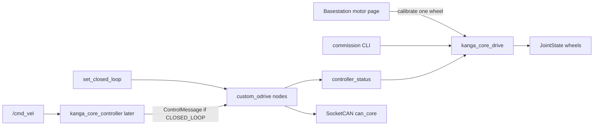

# Next steps: core drive + controller

Agreed design for the rover-base ODrive stack. **`kanga_core_drive` is
implemented on this branch** (offline-validated; rover HW pending).
`kanga_core_controller` follows in a later branch.

Related: [migration overview](README.md),
[`src/vendor/README.md`](../../src/vendor/README.md),
[`custom-ros-odrive`](https://github.com/UOW-TronSoc/custom-ros-odrive).

Old reference (mapper / launch): `ARCH2026-Kanga` → `src/kanga_drive`.

---

## Locked decisions

| Topic | Decision |
|-------|----------|
| Packages | **`kanga_core_drive`** — ODrive launch, Fibre configs, commission, closed-loop trigger, wheel JointState. **`kanga_core_controller`** — twist→wheel + setpoint stream (not started). |
| Branches | **`feat/drive-system`** (this branch: vendor pin + drive). Then **`feat/core-controller`**. |
| custom_odrive | Do not change the C++ node unless blocked. Apply/calibrate/save via existing `commission` CLI. |
| Calibrate | **One motor at a time.** CLI and/or ROS service (basestation motor-status button per motor). |
| Save config | Apply shared+individual, then `--save`. Sequential one-at-a-time in a single CLI command. Command only. |
| Stream | Owned by controller later: Alternative A (~10 Hz desired stream) **only while CLOSED_LOOP**. Stale `/cmd_vel` → desired 0. |
| Firmware watchdog | Shared Fibre config uses **`watchdog_timeout = 1`** (seconds). |
| Invert | Launch `invert_direction` only. URDF sign check later. |
| Deferred | Diff-bar JointState, odom, errors/UX, WHS, rover HW validation. |



---

## Branch 1 — vendor pin + `kanga_core_drive` (this branch)

### Vendor

`custom-ros-odrive` pinned in `kanga_vendor.repos`. Import:

```bash
vcs import src/vendor < src/vendor/kanga_vendor.repos
colcon build --packages-select custom_odrive odrive_base kanga_core_drive
source install/setup.bash
```

### Package owns

| Piece | Role |
|-------|------|
| `launch/wheels.launch.py` | 4× `custom_odrive_node` on `can_core`, namespaces `wheel_fl/bl/br/fr`, ids 1–4, left invert (no `start_enabled` override; use `/drivestop` for stop) |
| `config/wheels.yaml` | Canonical map |
| `config/motors/` | `shared_motor_config.py` + per-wheel overlays |
| `commission_wheels` | Concat shared+individual → call `custom_odrive commission` |
| `drive_manager` | `set_closed_loop` + `calibrate_fl/bl/br/fr` (Trigger) |
| `wheel_joint_state_publisher` | `controller_status` → wheel `JointState` |

### Fibre configs

```text
config/motors/
  shared_motor_config.py      # common odrv.*; watchdog_timeout = 1; baud 500000
  wheel_fl_motor_config.py    # SERIAL_NUMBER + node_id + per-wheel diffs
  ...
```

Commission merges shared then individual into a temp file before calling
`custom_odrive commission`.

### CLI

```bash
# Apply + save all wheels (sequential)
ros2 run kanga_core_drive commission_wheels -- \
  --wheels all --can can_core --save

# Calibrate one wheel
ros2 run kanga_core_drive commission_wheels -- \
  --wheels fl --can can_core --calibrate
```

### Services (`drive_manager`)

- `~/set_closed_loop` (`std_srvs/SetBool`) — true: clear_errors + CLOSED_LOOP(8) all wheels; false: IDLE(1); no `set_enabled` (use `/drivestop`)
- `~/calibrate_fl`, `~/calibrate_bl`, `~/calibrate_br`, `~/calibrate_fr` (`std_srvs/Trigger`) — one-wheel FULL_CALIBRATION; rejects if busy

---

## Branch 2 — `kanga_core_controller` (later)

- Pure kinematics library + unit tests (old `kanga_drive` mapper math)
- Mapper: `/cmd_vel` → desired; stale → 0; publish `ControlMessage` at ~10 Hz **only in CLOSED_LOOP**
- No invert; no axis-state/enable

---

## Offline checks (no rover)

- `colcon build` for vendor ODrive + `kanga_core_drive`
- Config-merge unit test
- Launch may fail at runtime without `can_core` — expected until hardware

## Bench checklist (when rover available)

1. Import + build
2. `wheels.launch.py` — four namespaces idle / not enabled
3. `set_closed_loop true` → `velocity_ramp_test` on one wheel
4. `commission_wheels --wheels fl --calibrate` (wheel off ground)
5. `commission_wheels --wheels all --save`
6. JointState echoes estimates
